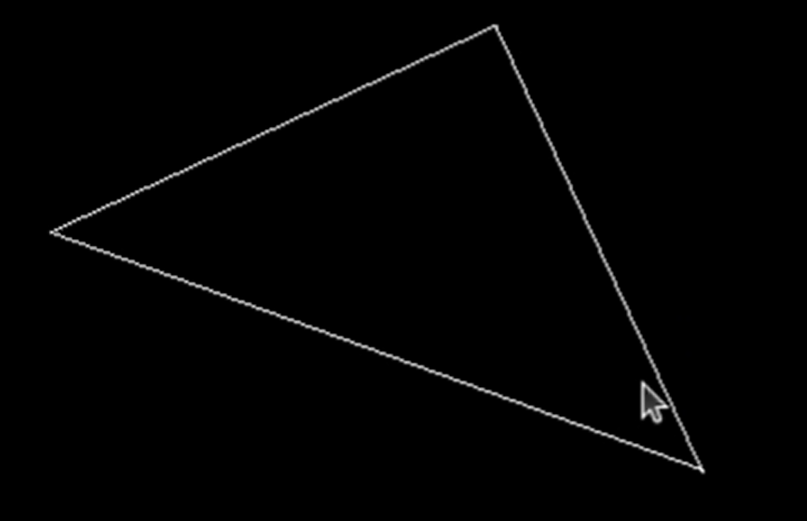
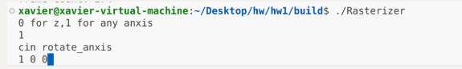
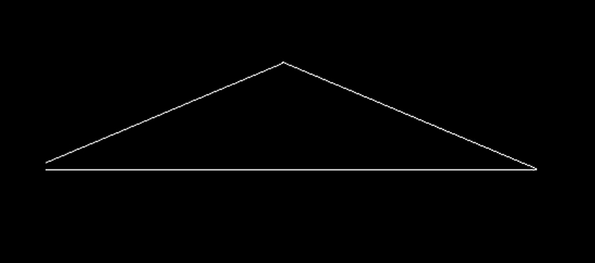
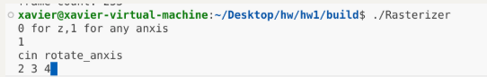

## games101 作业

#### 配置环境

ubuntu/vscode/c++/opencv/c++

很麻烦，有空再补充

#### HW1-0

这个作业主要是熟悉和了解Eigen库中的一些基本操作

头文件：

```c++
#include<cmath>
#include<eigen3/Eigen/Core>
#include<eigen3/Eigen/Dense>
#include<iostream>
```

构建一个向量

```c++
Eigen::Vector3f v(1.0f,2.0f,3.0f);
Eigen::Vector3f w(1.0f,0.0f,0.0f);
```

构建一个矩阵

```c++
 Eigen::Matrix3f i,j;
    i << 1.0, 2.0, 3.0, 4.0, 5.0, 6.0, 7.0, 8.0, 9.0;
    j << 2.0, 3.0, 1.0, 4.0, 6.0, 5.0, 9.0, 7.0, 8.0;
```

接着就是向量和矩阵的运算，这个很简单

之后是计算一个点旋转和平移后的坐标

我这里多写了一点：输入点的坐标，输入旋转角度，输入平移距离，然后输出结果

##### 流程：

###### 1.编写代码，main .cpp

代码内容比较简单就不贴了，主要是一些向量矩阵操作

###### 2.编写cmakelists，CMakeLists.txt

还待学习

```cmake
# 设置CMake所需的最低版本为3.17
cmake_minimum_required(VERSION 3.17)

# 创建一个名为games101_hw1的项目
project(games101_hw1)

# 查找Eigen3库，如果未找到则报错
find_package(Eigen3 REQUIRED)

# 将Eigen3的头文件目录添加到包含目录中
include_directories(${EIGEN3_INCLUDE_DIR})

# 设置C++标准为C++11
set(CMAKE_CXX_STANDARD 11)

# 添加一个可执行文件，目标名为games101_hw1，源文件为main.cpp
add_executable(games101_hw1 main.cpp)
```


###### 3编译:

在终端

```bash
mkdir build

cd build

cmake ..

make    
//编译程序

./games101_hw1 
//运行编译结果，可执行文件由cmakelists里面确定
```

###### 结果


#### HW1-1MVP model view Projection

实现控制三角形绕z轴和任意轴旋转

主要是阅读理解和补全代码

##### 1.camera/view/model transformation

```c++
Eigen::Matrix4f get_view_matrix(Eigen::Vector3f eye_pos) //get view matrix, use vector eye_pos as parameter
{
    Eigen::Matrix4f view = Eigen::Matrix4f::Identity();//get an identity matrix view

    Eigen::Matrix4f translate;                          
    translate << 1, 0, 0, -eye_pos[0], 
    0, 1, 0, -eye_pos[1], 
    0, 0, 1,-eye_pos[2], 
    0, 0, 0, 1;

    view = translate * view;

    return view;
}
```

##### 2.绕z轴旋转

```c++
Eigen::Matrix4f get_model_matrix(float rotation_angle)
{
    Eigen::Matrix4f model = Eigen::Matrix4f::Identity();

    // TODO: Implement this function
    // Create the model matrix for rotating the triangle around the Z axis.
    // Then return it.
    model(0,0)=std::cos(rotation_angle/180.0*MY_PI);
    model(0,1)=-std::sin(rotation_angle/180.0*MY_PI);
    model(1,0)=std::sin(rotation_angle/180.0*MY_PI);
    model(1,1)=std::cos(rotation_angle/180.0*MY_PI);

    return model;
}
```


##### 3.绕任意轴旋转

```c++
Eigen::Matrix4f get_rotation(Eigen::Vector3f axis, float angle)//
{
    float rangle=angle/180.0f*MY_PI;
    Eigen::Matrix3f R=Eigen::Matrix3f::Zero();
    Eigen::Matrix3f I=Eigen::Matrix3f::Identity();
    Eigen::Matrix3f temp;
    temp<<0,-axis[2],axis[1],
    axis[2],0,-axis[0],
    -axis[1],axis[0],0;
    R=std::cos(rangle)*I+(1-std::cos(rangle))*axis*axis.transpose()+std::sin(rangle)*temp;
    Eigen::Matrix4f model;
    model<<R(0,0),R(0,1),R(0,2),0.0f,
    R(1,0),R(1,1),R(1,2),0.0f,
    R(2,0),R(2,1),R(2,2),0.0f,
    0.0f,0.0f,0.0f,1.0f;

    return model;

}
```

##### 4，projection transformation

```c++

Eigen::Matrix4f get_projection_matrix(float eye_fov, float aspect_ratio,
                                      float zNear, float zFar)
{
    // Students will implement this function

    Eigen::Matrix4f projection = Eigen::Matrix4f::Identity();
    Eigen::Matrix4f persp_ortho = Eigen::Matrix4f::Identity();
    Eigen::Matrix4f ortho = Eigen::Matrix4f::Identity();
    Eigen::Matrix4f ortho1 = Eigen::Matrix4f::Identity();
    Eigen::Matrix4f ortho2 = Eigen::Matrix4f::Identity();

    persp_ortho(0,0)=zNear;
    persp_ortho(1,1)=zNear;
    persp_ortho(2,2)=zNear+zFar;
    persp_ortho(2,3)=-zNear*zFar;
    persp_ortho(3,2)=1.0f;
    persp_ortho(3,3)=0.0f;

    // 计算正交投影矩阵的参数
    float fov_radians = eye_fov * MY_PI / 180.0f; // 将角度转换为弧度
    float top = -zNear * std::tan(fov_radians / 2.0f); // 上边界
    float bottom = -top; // 下边界
    float right = top * aspect_ratio; // 右边界
    float left = -right; // 左边界

    //translate
    ortho2(0,3)=-(right+left)/2;
    ortho2(1,3)=-(top+bottom)/2;
    ortho2(2,3)=-(zNear+zFar)/2;

    //scale
    ortho1(0,0)=2/(right-left);
    ortho1(1,1)=2/(top-bottom);
    ortho1(2,2)=2/(zNear-zFar);

    projection=ortho1*ortho2*persp_ortho;


    // TODO: Implement this function
    // Create the projection matrix for the given parameters.
    // Then return it.

    return projection;
}
```

增加了点判断逻辑，判断是绕z轴旋转还是绕任意轴旋转，并输入任意轴

不知道为什么

会报错

```bash
./Rasterizer: symbol lookup error: /snap/core20/current/lib/x86_64-linux-gnu/libpthread.so.0: undefined symbol: __libc_pthread_init, version GLIBC_PRIVATE
```

要加上下面这段代码才能运行

```bash
unset GTK_PATH
```

##### 结果：

绕z轴旋转



绕1，0，0旋转





绕3，4，5旋转




#### HW2深度测试

这章感觉就有些难度了，有一些是上课没说到的（说到的还是很好理解，可能有的目前还没看到），主要是涉及到很多其他的方法

慢慢来理解

补充一些，z值会被视作深度信息，和绘制有关：

在将一个三角形光栅化的过程中，如果原始三角形的顶点坐标在[-1, 1]³立方体内（即NDC空间），这些坐标会经过一系列变换，最终被映射到屏幕空间。以下是具体的过程：

1.**视口变换（Viewport Transformation）**：   - NDC空间中的坐标范围是[-1, 1]，而屏幕空间的坐标范围通常是[0, width]（x方向）和[0, height]（y方向）。  

视口变换将NDC空间的坐标映射到屏幕空间。假设屏幕宽度为`width`，高度为`height`，视口变换公式如下：     
$$
     x_{\text{screen}} = \left(\frac{x_{\text{NDC}} + 1}{2}\right) \times \text{width}     
$$
​     
$$
     y_{\text{screen}} = \left(\frac{y_{\text{NDC}} + 1}{2}\right) \times \text{height}     
$$

$$
z_{\text{screen}} = \left(\frac{z_{\text{NDC}} + 1}{2}\right) \times \text{depth}
$$
其中  
$$
z_{\text{screen}}
$$
通常用于深度缓冲区（depth buffer），范围通常是[0, 1]。

2.**透视除法（Perspective Division）**：   - 在NDC空间之前，通常会进行透视除法，将顶点的齐次坐标转换为笛卡尔坐标。透视除法的公式如下：    
$$
     x_{\text{NDC}} = \frac{x_{\text{clip}}}{w_{\text{clip}}}     
$$

$$
y_{\text{NDC}} = \frac{y_{\text{clip}}}{w_{\text{clip}}}
$$
​     
$$
     z_{\text{NDC}} = \frac{z_{\text{clip}}}{w_{\text{clip}}}     
$$
3.**深度缓冲区（Depth Buffer）**：   - 在光栅化过程中，每个像素的深度值会被存储在深度缓冲区中，用于深度测试（z-buffering）。深度值通常是经过透视除法后的
$$
z_{\text{NDC}}
$$
，范围在[-1, 1]。   - 在代码中，`z_interpolated`是通过插值计算得到的透视校正后的深度值，用于与深度缓冲区中的值进行比较，决定是否更新像素颜色。 

总结： -原始三角形的顶点坐标在[-1, 1]³立方体内（NDC空间）。

经过透视除法后，这些坐标仍然是在[-1, 1]³范围内。 - 最后，通过视口变换将这些坐标映射到屏幕空间的具体像素位置。 

深度值（z值）在光栅化过程中用于深度测试，确保只有离观察者更近的像素才会被绘制。 在代码中，`z_interpolated`就是经过透视校正后的深度值，用于与深度缓冲区中的值进行比较。


##### 1.static bool insideTriangle(): 测试点是否在三角形内。

```c++
static bool insideTriangle(int x, int y, const Vector3f* _v)
{   
    // TODO : Implement this function to check if the point (x, y) is inside the triangle represented by _v[0], _v[1], _v[2]
    bool inTriangle = false;
    Eigen::Vector3f P = Vector3f(x, y, 1.0);
    Eigen::Vector3f AB= _v[1]-_v[0];
    Eigen::Vector3f BC= _v[2]-_v[1];
    Eigen::Vector3f CA= _v[0]-_v[2];

    Eigen::Vector3f AP= P-_v[0];
    Eigen::Vector3f BP= P-_v[1];
    Eigen::Vector3f CP= P-_v[2];

    float z1=AB.cross(AP).z();
    float z2=BC.cross(BP).z();
    float z3=CA.cross(CP).z();

    if((z1>0 && z2>0 && z3>0)|| (z1<0 && z2<0 && z3<0)){
        inTriangle = true;
    }

    return inTriangle;
    
}
```

`const Vector3f* _v` 是一个指向 `Vector3f` 类型的常量指针，表示一个指向三个 `Vector3f` 类型元素的数组的起始位置。

用指针来实现的连续储存的三角形的三个顶点

A.cross(B)表示的是向量A和B的叉乘(结果也是向量)，如果叉乘的Z值都大于0或者小于0则在三角形的内部

对于两个二维向量 
$$
(\mathbf{u} = (u_x, u_y))和(\mathbf{v} = (v_x, v_y))
$$


它们的叉积可以表示为：
$$
[ \mathbf{u} \times \mathbf{v} = u_x v_y - u_y v_x ]
$$
这个结果实际上是一个标量，表示的是这两个向量构成的平行四边形的有符号面积。如果我们将这个结果视为一个三维向量的 z 分量，则其值为：
$$
[ (\mathbf{u} \times \mathbf{v})_z = u_x v_y - u_y v_x ]
$$
可以发现与u和v的z分量无关

##### 2.rasterize_triangle(): 执行三角形栅格化算法

###### ①创建三角形的 2 维 bounding box。

```C++
   int min_x = std::min(v[0].x(), std::min(v[1].x(), v[2].x()));
    int max_x = std::max(v[0].x(), std::max(v[1].x(), v[2].x()));
    int min_y = std::min(v[0].y(), std::min(v[1].y(), v[2].y()));
    int max_y = std::max(v[0].y(), std::max(v[1].y(), v[2].y()));
```


###### ②遍历此 bounding box 内的所有像素（使用其整数索引）。然后，使用像素中心的屏幕空间坐标来检查中心点是否在三角形内。

###### ③如果在内部，则将其位置处的插值深度值 (interpolated depth value) 与深度缓冲区 (depth buffer) 中的相应值进行比较。

###### ④如果当前点更靠近相机，请设置像素颜色并更新深度缓冲区 (depth buffer)。

```c++
for (int x =(int) min_x; x < max_x; x++)
        {
            for (int y =(int) min_y; y < max_y; y++)
            {//遍历所有像素
                if (insideTriangle(x+0.5, y+0.5, t.v))
                {//检查像素中心是不是在三角形内
                    
//计算三角形内某点的深度值（z值），并进行透视校正。
                    auto[alpha, beta, gamma] = computeBarycentric2D(x, y,t.v);
                    //使用computeBarycentric2D函数计算点(x, y)相对于三角形顶点t.v的重心坐标(alpha, beta, gamma)。
                    float w_reciprocal = 1.0/(alpha / v[0].w() + beta / v[1].w() + gamma / v[2].w());//计算透视权重的倒数w_reciprocal。这里v[0].w(), v[1].w(), v[2].w()分别是三角形三个顶点的w分量（通常是1/w，用于透视除法）。
                    
                    float z_interpolated = alpha * v[0].z() / v[0].w() + beta * v[1].z() / v[1].w() + gamma * v[2].z() / v[2].w();// 对z进行插值，在插值顶点属性（如深度 z）时，需要考虑齐次坐标的影响。具体来说，对于每个顶点 v[i]，其深度值 z 应该先除以 w，然后再进行插值。
                    z_interpolated *= w_reciprocal;
                    //基于重心坐标插值的，而重心坐标本身也受齐次坐标影响，因此需要对插值后的值进行调整。具体来说，需要乘以 w_reciprocal，以确保插值结果在透视变换后仍然正确。

                    float buf_index = get_index(x, y);
                    //float buf_index = get_index(x, y);：通过 get_index 函数将屏幕坐标 (x, y) 转换为深度缓冲区中的线性索引。这个索引用于访问深度缓冲区 depth_buf 中对应位置的深度值。
                    if (z_interpolated < depth_buf[buf_index])//if (z_interpolated < depth_buf[buf_index])：检查当前插值得到的深度值 z_interpolated 是否小于深度缓冲区中已存储的深度值 depth_buf[buf_index]。如果当前深度值更小，则说明当前像素应该被绘制，因为它比之前绘制的物体更接近摄像机。
                    {
                        depth_buf[buf_index] = z_interpolated;//depth_buf[buf_index] = z_interpolated;：如果当前深度值更小，则更新深度缓冲区中的值为新的深度值 z_interpolated。这一步确保了深度缓冲区始终保存的是最近的深度信息。
                        set_pixel(Eigen::Vector3f(x, y, z_interpolated), t.getColor());//调用 set_pixel 函数将当前像素的颜色设置为三角形的颜色 t.getColor()，并将深度值 z_interpolated 作为第三个参数传递给该函数。这一步实际绘制了像素。
                    }
                }
            }
        }
    }
```

##### 3.一些课程中没提到的内容补充

###### 插值属性

重心坐标具有线性插值的特性。对于三角形内的任意点 P，可以通过重心坐标将三角形顶点的属性（如颜色、深度等）线性插值到该点。

具体来说，如果三角形的三个顶点分别为 A, B, C，对应的属性分别为 a, b, c，则点 P 的属性 p 可以通过以下公式计算： 
$$
[ p = \alpha \cdot a + \beta \cdot b + \gamma \cdot c ]
$$


这里的 `alpha`, `beta`, 和 `gamma` 就是点 P 的重心坐标，它们分别表示点 P 在三角形内相对于顶点 A, B, C 的权重。

###### **为什么 `w_reciprocal` 长这样？**

[图形学 - 关于透视矫正插值那些事 - 知乎](https://zhuanlan.zhihu.com/p/403259571)

`w_reciprocal` 的计算公式是为了确保插值后的值在透视变换后仍然是线性的。具体来说：

**透视校正插值**：在透视投影中，顶点的 `w` 分量会影响插值结果。为了保证插值结果的正确性，我们需要对每个顶点的属性（如深度 `z`）先除以 `w`，然后进行插值，最后再乘以 `w_reciprocal` 来恢复原始的比例关系。

**数学推导**：假设我们有三个顶点 `v[0]`, `v[1]`, `v[2]`，它们的齐次坐标分别为 `(x0, y0, z0, w0)`, `(x1, y1, z1, w1)`, `(x2, y2, z2, w2)`。对于任意一点 P(x, y)，其重心坐标为 `alpha`, `beta`, `gamma`，则插值后的深度值应为： 
$$
[ z_{\text{interpolated}} = \frac{\alpha \cdot \frac{z0}{w0} + \beta \cdot \frac{z1}{w1} + \gamma \cdot \frac{z2}{w2}}{\alpha / w0 + \beta / w1 + \gamma / w2} ]
$$
这里的分母就是 `w_reciprocal` 的计算公式。

**原始比例关系**：在透视投影前，顶点的属性（如深度 `z`）是线性分布的。经过 MVP 变换后，顶点的 `w` 分量发生了变化，导致这些属性在齐次坐标系中不再是线性分布的。

###### 隐藏面消除（Hidden Surface Removal）和避免错误覆盖

在三维渲染中，多个三角形可能会投影到相同的屏幕像素上。为了确保只绘制最前面的三角形（即离摄像机最近的三角形），我们需要使用深度缓冲区来记录每个像素的深度值。只有当新计算的深度值更小时，才更新深度缓冲区并绘制像素。

如果不进行深度测试，后面的三角形可能会错误地覆盖前面的三角形，导致渲染结果不正确。通过深度测试，可以确保渲染结果符合预期，展示正确的可见表面。

##### 4.MSAA

###### 代码内容

```c++
// 遍历当前三角形的边界框内的所有像素
for (int x = (int)min_x; x < max_x; x++) {
    for (int y = (int)min_y; y < max_y; y++) {
        int sample_point = 0; // 记录当前像素内有多少个采样点在三角形内部
        
        // 对每个像素进行 2x2 的子像素采样
        for (int i = 0; i < 2; i++) {
            for (int j = 0; j < 2; j++) {
                // 计算子像素的位置，偏移量为 0.25 + 0.5 * i 和 0.25 + 0.5 * j
                float x_sample = (float)x + 0.25 + 0.5 * i;
                float y_sample = (float)y + 0.25 + 0.5 * j;

                // 检查子像素是否在三角形内部
                if (insideTriangle(x_sample, y_sample, t.v)) {
                    // 计算子像素的重心坐标
                    auto [alpha, beta, gamma] = computeBarycentric2D(x_sample, y_sample, t.v);

                    // 计算 w_reciprocal 以确保插值结果在透视投影中是线性的
                    float w_reciprocal = 1.0 / (alpha / v[0].w() + beta / v[1].w() + gamma / v[2].w());

                    // 插值深度值 z_interpolated
                    float z_interpolated = alpha * v[0].z() / v[0].w() + beta * v[1].z() / v[1].w() + gamma * v[2].z() / v[2].w();
                    z_interpolated *= w_reciprocal;

                    // 计算深度缓冲区中的索引
                    int buf_index = (x * 2 + i) + (y * 2 + j) * width * 2;

                    // 比较并更新深度缓冲区中的深度值
                    if (z_interpolated < depth_buf_msaa22[buf_index]) {
                        depth_buf_msaa22[buf_index] = z_interpolated;
                        sample_point++; // 增加在三角形内部的采样点计数
                    }
                }
            }
        }

        // 如果有至少一个采样点在三角形内部，则根据采样点的数量设置像素颜色
        if (sample_point > 0) {
            // 计算采样点的比例
            float sample = float(sample_point) / 4.0f;
            
            // 调用 msaa_pixel 函数设置像素颜色，并根据采样点比例混合颜色
            msaa_pixel(Eigen::Vector3f(x, y, 1.0f), t.getColor() * sample);
        }
    }
}
```

```c++
void rst::rasterizer::msaa_pixel(const Eigen::Vector3f& point, const Eigen::Vector3f& color)
{
    // 计算像素在帧缓冲区中的索引
    // 由于 OpenGL 的坐标系是从左下角开始的，而我们的坐标系是从左上角开始的，因此需要进行坐标转换
    // old index: auto ind = point.y() + point.x() * width;
    auto ind = (height - 1 - point.y()) * width + point.x();

    // 两三角形边界处应该是颜色的混合
    // 题目里边界处就是3/4的绿色混合1/4的蓝色
    // 这里直接将颜色累加到帧缓冲区中，实现颜色混合
    frame_buf[ind] += color;
}
```

其他修改的地方

`rst::rasterizer::rasterizer(int w, int h)` 构造函数的主要作用是初始化和构造缓冲区，包括帧缓冲区（`frame_buf`）、深度缓冲区（`depth_buf`）和多采样抗锯齿（MSAA）深度缓冲区（`depth_buf_msaa22`）。

```c++
rst::rasterizer::rasterizer(int w, int h) : width(w), height(h)
{
    // 初始化宽度和高度
    // width 和 height 分别表示帧缓冲区的宽度和高度
    // 这些值通过构造函数参数传递进来

    // 调整帧缓冲区的大小
    // 帧缓冲区用于存储每个像素的颜色信息
    // 大小为 width * height
    frame_buf.resize(w * h);

    // 调整深度缓冲区的大小
    // 深度缓冲区用于存储每个像素的深度信息
    // 大小为 width * height
    depth_buf.resize(w * h);

    // 调整 MSAA 深度缓冲区的大小
    // MSAA 深度缓冲区用于存储每个子像素的深度信息
    // 每个像素被划分为 2x2 的子像素，因此大小为 width * height * 2 * 2
    depth_buf_msaa22.resize(w * h * 2 * 2);
}
```

`rst::rasterizer::clear(rst::Buffers buff)` 函数的主要作用是根据传入的 `buff` 参数清除指定的缓冲区：

**颜色缓冲区 (`frame_buf`)**：如果 `buff` 包含 `rst::Buffers::Color` 标志，则将所有像素的颜色设置为黑色。

**深度缓冲区 (`depth_buf`)**：如果 `buff` 包含 `rst::Buffers::Depth` 标志，则将所有像素的深度值设置为正无穷大。

MSAA 深度缓冲区 (`depth_buf_msaa22`)：如果 `buff` 包含 `rst::Buffers::Depth` 标志，则将所有子像素的深度值设置为正无穷大。

```c++
void rst::rasterizer::clear(rst::Buffers buff)
{
    // 检查是否需要清除颜色缓冲区
    if ((buff & rst::Buffers::Color) == rst::Buffers::Color)
    {
        // 使用 std::fill 将帧缓冲区 frame_buf 中的所有元素设置为 (0, 0, 0)
        // 这表示将所有像素的颜色设置为黑色
        std::fill(frame_buf.begin(), frame_buf.end(), Eigen::Vector3f{0, 0, 0});
    }

    // 检查是否需要清除深度缓冲区
    if ((buff & rst::Buffers::Depth) == rst::Buffers::Depth)
    {
        // 使用 std::fill 将深度缓冲区 depth_buf 中的所有元素设置为正无穷大
        // 这表示将所有像素的深度值初始化为最大值，以便后续的深度测试
        std::fill(depth_buf.begin(), depth_buf.end(), std::numeric_limits<float>::infinity());

        // 使用 std::fill 将 MSAA 深度缓冲区 depth_buf_msaa22 中的所有元素设置为正无穷大
        // 这表示将所有子像素的深度值初始化为最大值，以便后续的深度测试
        std::fill(depth_buf_msaa22.begin(), depth_buf_msaa22.end(), std::numeric_limits<float>::infinity());
    }
}
```

还要在rasterizer.hpp添加新函数和数据结构depth_buf_mass中的定义

###### 一些注意点

①(x * 2 + i) + (y * 2 + j) * width * 2`：计算子像素在深度缓冲区 `depth_buf_msaa22` 中的线性索引。

width * 2`：由于每个像素被划分为 2x2 的子像素，因此宽度需要乘以 2。

`(y * 2 + j) * width * 2`：计算子像素在 y 方向上的偏移量。

(x * 2 + i) + (y * 2 + j) * width * 2`：将子像素的 x 和 y 坐标转换为线性索引。

②假设有一个像素 `(x, y)`，其在帧缓冲区中的索引 `ind` 通过上述公式计算得出。如果该像素有 4 个子像素采样，每个子像素的颜色分别为 `color1`, `color2`, `color3`, `color4`，则最终该像素的颜色为：
$$
[ \text{frame_buf}[ind] = \text{color1} + \text{color2} + \text{color3} + \text{color4} ]
$$

#### HW3法向量、纹理颜色、颜色插值

##### task1:插值算法

修改函数 rasterize_triangle(const Triangle& t) in rasterizer.cpp: 在此 处实现与作业 2 类似的插值算法，实现法向量、颜色、纹理颜色的插值。

###### 先看下画三角形的代码

```c++
void rst::rasterizer::draw(std::vector<Triangle *> &TriangleList) {

    float f1 = (50 - 0.1) / 2.0;
    float f2 = (50 + 0.1) / 2.0;

    Eigen::Matrix4f mvp = projection * view * model;//模型和视图变换
    for (const auto& t:TriangleList)//遍历三角形列表中的每一个三角形
    {
        Triangle newtri = *t;

        std::array<Eigen::Vector4f, 3> mm {
                (view * model * t->v[0]),
                (view * model * t->v[1]),
                (view * model * t->v[2])
        };//变换到视图空间

        std::array<Eigen::Vector3f, 3> viewspace_pos;  // 提取视图空间坐标中的前三个分量（x, y, z）

        std::transform(mm.begin(), mm.end(), viewspace_pos.begin(), [](auto& v) {
            return v.template head<3>();
        });// 使用 lambda 表达式将 mm 中的每个向量转换为三维向量并存储在 viewspace_pos 中

        Eigen::Vector4f v[] = {
                mvp * t->v[0],
                mvp * t->v[1],
                mvp * t->v[2]
        };//// 将三角形顶点从模型空间变换到裁剪空间

        // 进行齐次除法，将裁剪空间坐标转换为标准化设备坐标（NDC）
        for (auto& vec : v) {
            vec.x()/=vec.w();
            vec.y()/=vec.w();
            vec.z()/=vec.w();
        }

        // 将三角形法线从模型空间变换到视图空间
        //https://blog.csdn.net/weixin_43347688/article/details/135440822
        Eigen::Matrix4f inv_trans = (view * model).inverse().transpose();
        Eigen::Vector4f n[] = {
                inv_trans * to_vec4(t->normal[0], 0.0f),
                inv_trans * to_vec4(t->normal[1], 0.0f),
                inv_trans * to_vec4(t->normal[2], 0.0f)
        };

        //视口变换，将 NDC 坐标转换为屏幕空间坐标
        for (auto & vert : v)
        {
            vert.x() = 0.5*width*(vert.x()+1.0);
            vert.y() = 0.5*height*(vert.y()+1.0);
            vert.z() = vert.z() * f1 + f2;
        }

        // 设置新的三角形顶点为屏幕空间坐标
        for (int i = 0; i < 3; ++i)
        {
            //screen space coordinates
            newtri.setVertex(i, v[i]);
        }

        // 设置新的三角形法线为视图空间法线
        for (int i = 0; i < 3; ++i)
        {
            //view space normal
            newtri.setNormal(i, n[i].head<3>());
        }

        //设置三角形颜色
        newtri.setColor(0, 148,121.0,92.0);
        newtri.setColor(1, 148,121.0,92.0);
        newtri.setColor(2, 148,121.0,92.0);

         // 光栅化三角形，并传递视图空间顶点位置
        rasterize_triangle(newtri, viewspace_pos);
    }
}
```

###### 再研究下三角形类class Triangle

```c++
class Triangle {
public:
    Vector4f v[3]; /* 三角形的原始坐标，v0, v1, v2 按逆时针顺序排列 */
/* 每个顶点的属性 */
Vector3f color[3]; // 每个顶点的颜色
Vector2f tex_coords[3]; // 每个顶点的纹理坐标 (u, v)
Vector3f normal[3]; // 每个顶点的法线向量

Texture *tex = nullptr; // 纹理指针，默认为空

Triangle(); // 默认构造函数

Eigen::Vector4f a() const { return v[0]; } // 获取第一个顶点坐标
Eigen::Vector4f b() const { return v[1]; } // 获取第二个顶点坐标
Eigen::Vector4f c() const { return v[2]; } // 获取第三个顶点坐标

void setVertex(int ind, Vector4f ver); /* 设置第 i 个顶点的坐标 */
void setNormal(int ind, Vector3f n); /* 设置第 i 个顶点的法线向量 */
void setColor(int ind, float r, float g, float b); /* 设置第 i 个顶点的颜色 */

void setNormals(const std::array<Vector3f, 3>& normals); // 批量设置所有顶点的法线向量
void setColors(const std::array<Vector3f, 3>& colors); // 批量设置所有顶点的颜色
void setTexCoord(int ind, Vector2f uv); /* 设置第 i 个顶点的纹理坐标 */

std::array<Vector4f, 3> toVector4() const; // 将三角形顶点转换为 Vector4f 数组
};
```
###### 还要研究下着色器结构体

- ***\*Fragment Shader Payload（片段着色器载荷）\****：这是指在图形渲染过程中，传递给片段着色器的数据集合。这些数据包括顶点着色器输出的数据，以及可能由几何着色器或其它管线阶段产生的数据。片段着色器使用这些数据来计算最终像素的颜色和深度值等信息。

```c++
// 片段着色器负载结构体，用于存储片段着色器所需的各种信息
struct fragment_shader_payload
{
    // 默认构造函数：将纹理指针初始化为nullptr
    fragment_shader_payload()
    {
        texture = nullptr;
    }

    // 带参数的构造函数：接受颜色、法线、纹理坐标和纹理指针进行初始化
    fragment_shader_payload(const Eigen::Vector3f& col, const Eigen::Vector3f& nor,
                            const Eigen::Vector2f& tc, Texture* tex) :
        color(col), normal(nor), tex_coords(tc), texture(tex) {}

    Eigen::Vector3f view_pos;  // 视图空间中的顶点位置
    Eigen::Vector3f color;     // 顶点颜色
    Eigen::Vector3f normal;    // 顶点法线
    Eigen::Vector2f tex_coords;// 纹理坐标
    Texture* texture;          // 纹理指针
};
```

###### 然后我们就可以看作业要补充的代码了

```c++
void rst::rasterizer::rasterize_triangle(const Triangle& t, const std::array<Eigen::Vector3f, 3>& view_pos)   //三角形对象和视图空间坐标（视图空间指的是经过模型变换和视图变换得到的空间)
{
    auto v = t.toVector4();
    int min_x = std::min(std::min(v[0].x(), v[1].x()), v[2].x());
    int max_x = std::max(std::max(v[0].x(), v[1].x()), v[2].x());
    int min_y = std::min(std::min(v[0].y(), v[1].y()), v[2].y());
    int max_y = std::max(std::max(v[0].y(), v[1].y()), v[2].y()); 
    //找到需要检查的那个区域bounding box好像叫这个
    for (int x =int (min_x); x <= max_x; x++)
    {
        for (int y = int (min_y); y <= max_y; y++)
        {//遍历box中的像素
            if(insideTriangle(x+0.5, y+0.5, t.v))
            {//如果像素的中心在三角形中
                auto[alpha, beta, gamma] = computeBarycentric2D(x+0.5, y+0.5, t.v);//得到重心坐标
                float Z = 1.0 / (alpha / v[0].w() + beta / v[1].w() + gamma / v[2].w());
                float zp = alpha * v[0].z() / v[0].w() + beta * v[1].z() / v[1].w() + gamma * v[2].z() / v[2].w();
                zp *= Z;//深度插值

                if(zp < depth_buf[get_index(x, y)]){//如果深度小于zbuffer，表示离摄像头更近
                depth_buf[get_index(x, y)] = zp;
                //插值的实现
                auto interpolated_color = interpolate(alpha, beta, gamma, t.color[0], t.color[1], t.color[2], 1);//颜色插值
                auto interpolated_normal = interpolate(alpha, beta, gamma, t.normal[0], t.normal[1], t.normal[2], 1).normalized();//法线插值
                auto interpolated_shadingcoords = interpolate(alpha, beta, gamma, view_pos[0], view_pos[1], view_pos[2], 1);//纹理坐标
                auto interpolated_texcoords = interpolate(alpha, beta, gamma, t.tex_coords[0], t.tex_coords[1], t.tex_coords[2], 1);//纹理指针
                

                //调用片段着色器：创建 fragment_shader_payload 对象并传递插值得到的属性，调用片段着色器获取最终颜色。
                fragment_shader_payload pay_load(interpolated_color, interpolated_normal.normalized(), interpolated_texcoords, t.tex);
                pay_load.view_pos = interpolated_shadingcoords;
                auto pixel_color = fragment_shader(pay_load);
                set_pixel(Vector2i(x, y), pixel_color);
                }
            }
        }
    }
}
```

todo: msaa补充

##### task2: get_projection_matrix() 复制之前的

修改函数 get_projection_matrix() in main.cpp: 将你自己在之前的实验中 实现的投影矩阵填到此处，此时你可以运行 ./Rasterizer output.png normal 来观察法向量实现结果。

这里发现作业2里面有个方向错了，因为在作业2中z的值被默认取正了，所以要修改以下函数中的

```c++
Eigen::Matrix4f get_projection_matrix(float eye_fov, float aspect_ratio, float zNear, float zFar)
```

```c++
    //scale
	......
    ortho1(2,2)=2/(-zNear+zFar);
```

##### task3:Blinn-Phong 模型计算 Fragment Color.

修改函数 phong_fragment_shader() in main.cpp: 实现 Blinn-Phong 模型计算 Fragment Color.

这个好像比较简单

```c++
Eigen::Vector3f phong_fragment_shader(const fragment_shader_payload& payload)
{
    Eigen::Vector3f ka = Eigen::Vector3f(0.005, 0.005, 0.005);//ambient
    Eigen::Vector3f kd = payload.color;//diffuse
    Eigen::Vector3f ks = Eigen::Vector3f(0.7937, 0.7937, 0.7937);//specular

    auto l1 = light{{20, 20, 20}, {500, 500, 500}};
    auto l2 = light{{-20, 20, 0}, {500, 500, 500}};

    std::vector<light> lights = {l1, l2};
    Eigen::Vector3f amb_light_intensity{10, 10, 10};//环境光
    Eigen::Vector3f eye_pos{0, 0, 10};

    float p = 150;

    Eigen::Vector3f color = payload.color;
    Eigen::Vector3f point = payload.view_pos;
    Eigen::Vector3f normal = payload.normal;

    Eigen::Vector3f result_color = {0, 0, 0};
    for (auto& light : lights)
    {
        // TODO: For each light source in the code, calculate what the *ambient*, *diffuse*, and *specular* 
        // components are. Then, accumulate that result on the *result_color* object.
        Eigen::Vector3f light_pos = light.position - point;
        Eigen::Vector3f sight_pos = eye_pos - point;

        float r = light_pos.dot(light_pos);
        Eigen::Vector3f h= (light_pos.normalized() + sight_pos.normalized()).normalized();

        Eigen::Vector3f ambient = ka.cwiseProduct(amb_light_intensity);
        Eigen::Vector3f diffuse = kd.cwiseProduct(light.intensity/r)*std::max(0.0f,normal.dot(light_pos.normalized()));
        Eigen::Vector3f specular = ks.cwiseProduct(light.intensity/r)*std::pow(std::max(0.0f,normal.dot(h)),p);
        
        result_color+=ambient+diffuse+specular;
    }

    return result_color * 255.f;
}
```

注意的是在计算半程向量和反射的时候需要用单位向量.normalized()，然后在task1实现的函数中注意到我们也在传递参数的时候把payload.normal给归一化了

##### task4:Texture Shading Fragment Shader

修改函数 texture_fragment_shader() in main.cpp: 在实现 Blinn-Phong 的基础上，将纹理颜色视为公式中的 kd，实现 Texture Shading Fragment Shader.

```c++
   if (payload.texture)
    {
        // TODO: Get the texture value at the texture coordinates of the current fragment
        return_color = payload.texture->getColor(payload.tex_coords.x(), payload.tex_coords.y());

    }
    ....
     Eigen::Vector3f kd = texture_color / 255.f;
    ....
```

从原理上来说只要把漫反射的系数改成纹理的颜色（？）

代码框架中已经为我们写好了getcolor函数，只用调用就行了

不过我们还是来研究下getcolor怎么实现，也就是看下texture类，注意要保证该函数首先确保纹理坐标(u, v)在有效范围内，即[0, 1]

`v_img` 和 `u_img` 是根据纹理坐标 `u` 和 `v` 计算出的图像中的像素位置，`image_data` 是存储图像像素数据的矩阵。通过 `at<cv::Vec3b>(v_img, u_img)` 方法获取该位置的像素颜色，颜色值以 `cv::Vec3b` 类型返回，表示蓝色、绿色和红色三个通道的值。

`at` 是 OpenCV 库中用于访问 `cv::Mat` 对象中特定位置元素的方法。具体来说，`image_data.at<cv::Vec3b>(v_img, u_img)` 用于获取图像中指定像素位置的色彩值。 - `cv::Mat` 是 OpenCV 中用来存储图像数据的类。 - `cv::Vec3b` 表示一个包含三个无符号字符（即三个字节）的向量，通常用于表示 BGR 格式的颜色值（蓝色、绿色、红色）。 

**`at` 方法的作用**：  - `at` 方法允许你通过指定行和列索引来访问 `cv::Mat` 中的元素。  - 在代码中`image_data.at<cv::Vec3b>(v_img, u_img)` 返回的是位于 `(v_img, u_img)` 位置的像素的颜色值，该颜色值是一个 `cv::Vec3b` 类型的对象，包含三个分量：B（蓝色）、G（绿色）、R（红色）。 - **参数说明**：  - `v_img` 和 `u_img` 分别是图像的行和列索引，对应于纹理坐标 `(u, v)` 转换后的图像坐标。 ### 示例： 假设 `image_data` 是一个 BGR 图像，`v_img = 100` 和 `u_img = 200`，那么 `image_data.at<cv::Vec3b>(100, 200)` 将返回一个 `cv::Vec3b` 对象，表示图像中第 100 行、第 200 列像素的颜色值。  如果提供的索引超出图像边界，`at` 方法会抛出异常。已经通过条件语句确保了 `u` 和 `v` 的值在 `[0, 1]` 范围内，从而保证转换后的 `u_img` 和 `v_img` 不会越界。

```c++

// 定义一个纹理类，用于处理和存储图像数据
class Texture{
private:
    cv::Mat image_data; // 存储图像数据的变量

public:
    // 构造函数：初始化纹理对象并加载图像
    // 参数 name: 图像文件的路径
    Texture(const std::string& name)
    {
        image_data = cv::imread(name); // 读取图像文件
        cv::cvtColor(image_data, image_data, cv::COLOR_RGB2BGR); // 转换图像颜色空间从RGB到BGR
        width = image_data.cols; // 获取并存储图像的宽度
        height = image_data.rows; // 获取并存储图像的高度
    }

    int width, height; // 图像的宽度和高度

    // 根据纹理坐标获取颜色
    // 参数 u, v: 纹理坐标，范围在[0, 1]之间
    // 返回值：对应纹理坐标的颜色向量
    Eigen::Vector3f getColor(float u, float v)
    {
        // 确保纹理坐标在有效范围内
        if (u < 0)u = 0;
        if (u > 1)u = 1;
        if (v < 0)v = 0;
        if (v > 1)v = 1;

        // 将纹理坐标转换为图像坐标
        auto u_img = u * width;
        auto v_img = (1 - v) * height;

        // 从图像数据中获取颜色
        auto color = image_data.at<cv::Vec3b>(v_img, u_img);

        // 返回颜色向量
        return Eigen::Vector3f(color[0], color[1], color[2]);
    }

};

```

##### tast5：Bump mapping 凹凸映射

先看代码

```c++
Eigen::Vector3f bump_fragment_shader(const fragment_shader_payload& payload)
{
    // 定义环境光系数 ka，漫反射系数 kd（取自 payload 的颜色），镜面反射系数 ks
    Eigen::Vector3f ka = Eigen::Vector3f(0.005, 0.005, 0.005);
    Eigen::Vector3f kd = payload.color;
    Eigen::Vector3f ks = Eigen::Vector3f(0.7937, 0.7937, 0.7937);

    // 定义两个光源 l1 和 l2，分别位于 (20, 20, 20) 和 (-20, 20, 0)，光强为 (500, 500, 500)
    auto l1 = light{{20, 20, 20}, {500, 500, 500}};
    auto l2 = light{{-20, 20, 0}, {500, 500, 500}};

    // 将光源放入光源列表
    std::vector<light> lights = {l1, l2};
    // 定义环境光强度
    Eigen::Vector3f amb_light_intensity{10, 10, 10};
    // 定义观察者位置
    Eigen::Vector3f eye_pos{0, 0, 10};

    // 定义镜面反射的指数 p
    float p = 150;

    // 从 payload 中获取颜色、视点位置和法线
    Eigen::Vector3f color = payload.color; 
    Eigen::Vector3f point = payload.view_pos;
    Eigen::Vector3f normal = payload.normal;

    // 定义凹凸映射的参数 kh 和 kn
    float kh = 0.2, kn = 0.1;

    // 计算切向量 t 和副法向量 b
    float x = normal.x(), y = normal.y(), z = normal.z();
    Eigen::Vector3f t, b;
    t << x * y / std::sqrt(x * x + z * z), std::sqrt(x * x + z * z), z * y / std::sqrt(x * x + z * z);
    b = normal.cross(t);

    // 构建 TBN 矩阵，用于将法线从切线空间转换到世界空间
    Eigen::Matrix3f TBN;
    TBN << t.x(), b.x(), normal.x(),
           t.y(), b.y(), normal.y(),
           t.z(), b.z(), normal.z();

    // 获取纹理坐标和纹理的宽度、高度
    float u = payload.tex_coords.x(), v = payload.tex_coords.y();
    float w = payload.texture->width, h = payload.texture->height;

    // 计算纹理坐标 u 和 v 方向上的偏移量 dU 和 dV
    float dU = kh * kn * (payload.texture->getColor(u + 1.0 / w, v).norm() - payload.texture->getColor(u, v).norm());
    float dV = kh * kn * (payload.texture->getColor(u, v + 1.0 / h).norm() - payload.texture->getColor(u, v).norm());
    
    // 计算新的法线向量 ln
    Eigen::Vector3f ln;
    ln << -dU, -dV, 1;

    // 将法线从切线空间转换到世界空间，并归一化
    normal = (TBN * ln).normalized();

    // 初始化结果颜色为 (0, 0, 0)
    Eigen::Vector3f result_color = {0, 0, 0};
    // 将法线作为颜色输出（用于调试或可视化法线）
    result_color = normal;

    // 返回结果颜色，乘以 255 以将颜色值从 [0, 1] 转换到 [0, 255]
    return result_color * 255.f;
}
```

具体还有些地方没懂--，有机会补上

可以看看下面的博客

[GAMES101 作业 3: Pipeline and Shading【渲染管线与着色】-CSDN博客](https://blog.csdn.net/2301_79799657/article/details/143991642)

##### task6：displacement mapping.

```c++
point += kn*normal*payload.texture->getColor(u,v).norm();
```

只多了一行，待补充吧


