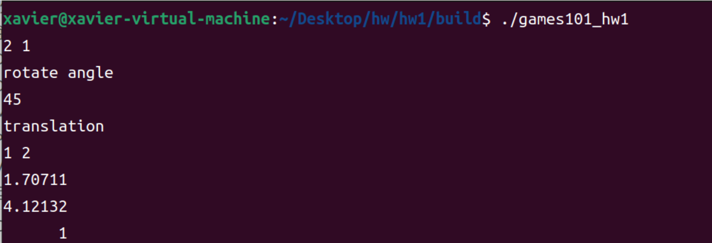
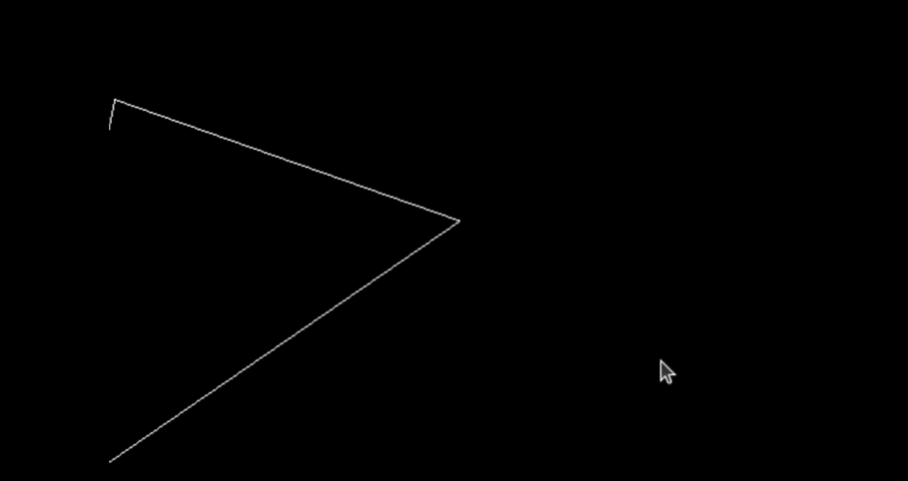

## games101 作业

#### 配置环境

ubuntu/vscode/c++/opencv/c++

很麻烦，有空再补充

#### HW1-0

这个作业主要是熟悉和了解Eigen库中的一些基本操作

头文件：

```c++
#include<cmath>
#include<eigen3/Eigen/Core>
#include<eigen3/Eigen/Dense>
#include<iostream>
```

构建一个向量

```c++
Eigen::Vector3f v(1.0f,2.0f,3.0f);
Eigen::Vector3f w(1.0f,0.0f,0.0f);
```

构建一个矩阵

```c++
 Eigen::Matrix3f i,j;
    i << 1.0, 2.0, 3.0, 4.0, 5.0, 6.0, 7.0, 8.0, 9.0;
    j << 2.0, 3.0, 1.0, 4.0, 6.0, 5.0, 9.0, 7.0, 8.0;
```

接着就是向量和矩阵的运算，这个很简单

之后是计算一个点旋转和平移后的坐标

我这里多写了一点：输入点的坐标，输入旋转角度，输入平移距离，然后输出结果

##### 流程：

###### 1.编写代码，main .cpp

代码内容比较简单就不贴了，主要是一些向量矩阵操作

###### 2.编写cmakelists，CMakeLists.txt

还待学习

```cmake
# 设置CMake所需的最低版本为3.17
cmake_minimum_required(VERSION 3.17)

# 创建一个名为games101_hw1的项目
project(games101_hw1)

# 查找Eigen3库，如果未找到则报错
find_package(Eigen3 REQUIRED)

# 将Eigen3的头文件目录添加到包含目录中
include_directories(${EIGEN3_INCLUDE_DIR})

# 设置C++标准为C++11
set(CMAKE_CXX_STANDARD 11)

# 添加一个可执行文件，目标名为games101_hw1，源文件为main.cpp
add_executable(games101_hw1 main.cpp)
```


###### 3编译:

在终端

```bash
mkdir build

cd build

cmake ..

make    
//编译程序

./games101_hw1 
//运行编译结果，可执行文件由cmakelists里面确定
```

###### 结果




#### HW1-1

实现控制三角形绕z轴和任意轴旋转

主要是阅读理解和补全代码

##### 1.camera/view/model transformation

```c++
Eigen::Matrix4f get_view_matrix(Eigen::Vector3f eye_pos) //get view matrix, use vector eye_pos as parameter
{
    Eigen::Matrix4f view = Eigen::Matrix4f::Identity();//get an identity matrix view

    Eigen::Matrix4f translate;                          
    translate << 1, 0, 0, -eye_pos[0], 
    0, 1, 0, -eye_pos[1], 
    0, 0, 1,-eye_pos[2], 
    0, 0, 0, 1;

    view = translate * view;

    return view;
}
```

##### 2.绕z轴旋转

```c++
Eigen::Matrix4f get_model_matrix(float rotation_angle)
{
    Eigen::Matrix4f model = Eigen::Matrix4f::Identity();

    // TODO: Implement this function
    // Create the model matrix for rotating the triangle around the Z axis.
    // Then return it.
    model(0,0)=std::cos(rotation_angle/180.0*MY_PI);
    model(0,1)=-std::sin(rotation_angle/180.0*MY_PI);
    model(1,0)=std::sin(rotation_angle/180.0*MY_PI);
    model(1,1)=std::cos(rotation_angle/180.0*MY_PI);

    return model;
}
```


##### 3.绕任意轴旋转

```c++
Eigen::Matrix4f get_rotation(Eigen::Vector3f axis, float angle)//
{
    float rangle=angle/180.0f*MY_PI;
    Eigen::Matrix3f R=Eigen::Matrix3f::Zero();
    Eigen::Matrix3f I=Eigen::Matrix3f::Identity();
    Eigen::Matrix3f temp;
    temp<<0,-axis[2],axis[1],
    axis[2],0,-axis[0],
    -axis[1],axis[0],0;
    R=std::cos(rangle)*I+(1-std::cos(rangle))*axis*axis.transpose()+std::sin(rangle)*temp;
    Eigen::Matrix4f model;
    model<<R(0,0),R(0,1),R(0,2),0.0f,
    R(1,0),R(1,1),R(1,2),0.0f,
    R(2,0),R(2,1),R(2,2),0.0f,
    0.0f,0.0f,0.0f,1.0f;

    return model;

}
```

##### 4，projection transformation

```c++

Eigen::Matrix4f get_projection_matrix(float eye_fov, float aspect_ratio,
                                      float zNear, float zFar)
{
    // Students will implement this function

    Eigen::Matrix4f projection = Eigen::Matrix4f::Identity();
    Eigen::Matrix4f persp_ortho = Eigen::Matrix4f::Identity();
    Eigen::Matrix4f ortho = Eigen::Matrix4f::Identity();
    Eigen::Matrix4f ortho1 = Eigen::Matrix4f::Identity();
    Eigen::Matrix4f ortho2 = Eigen::Matrix4f::Identity();

    persp_ortho(0,0)=zNear;
    persp_ortho(1,1)=zNear;
    persp_ortho(2,2)=zNear+zFar;
    persp_ortho(2,3)=-zNear*zFar;
    persp_ortho(3,2)=1.0f;
    persp_ortho(3,3)=0.0f;

    // 计算正交投影矩阵的参数
    float fov_radians = eye_fov * MY_PI / 180.0f; // 将角度转换为弧度
    float top = -zNear * std::tan(fov_radians / 2.0f); // 上边界
    float bottom = -top; // 下边界
    float right = top * aspect_ratio; // 右边界
    float left = -right; // 左边界

    //translate
    ortho2(0,3)=-(right+left)/2;
    ortho2(1,3)=-(top+bottom)/2;
    ortho2(2,3)=-(zNear+zFar)/2;

    //scale
    ortho1(0,0)=2/(right-left);
    ortho1(1,1)=2/(top-bottom);
    ortho1(2,2)=2/(zNear-zFar);

    projection=ortho1*ortho2*persp_ortho;


    // TODO: Implement this function
    // Create the projection matrix for the given parameters.
    // Then return it.

    return projection;
}
```

增加了点判断逻辑，判断是绕z轴旋转还是绕任意轴旋转，并输入任意轴

不知道为什么

会报错

```bash
./Rasterizer: symbol lookup error: /snap/core20/current/lib/x86_64-linux-gnu/libpthread.so.0: undefined symbol: __libc_pthread_init, version GLIBC_PRIVATE
```

要加上下面这段代码才能运行

```bash
unset GTK_PATH
```

##### 结果：

绕z轴旋转


绕1，0，0旋转


绕3，4，5旋转




#### HW2

这章感觉就有些难度了，有一些是上课没说到的（说到的还是很好理解，可能有的目前还没看到），主要是涉及到很多其他的方法

慢慢来理解

##### 1.static bool insideTriangle(): 测试点是否在三角形内。

```c++
static bool insideTriangle(int x, int y, const Vector3f* _v)
{   
    // TODO : Implement this function to check if the point (x, y) is inside the triangle represented by _v[0], _v[1], _v[2]
    bool inTriangle = false;
    Eigen::Vector3f P = Vector3f(x, y, 1.0);
    Eigen::Vector3f AB= _v[1]-_v[0];
    Eigen::Vector3f BC= _v[2]-_v[1];
    Eigen::Vector3f CA= _v[0]-_v[2];

    Eigen::Vector3f AP= P-_v[0];
    Eigen::Vector3f BP= P-_v[1];
    Eigen::Vector3f CP= P-_v[2];

    float z1=AB.cross(AP).z();
    float z2=BC.cross(BP).z();
    float z3=CA.cross(CP).z();

    if((z1>0 && z2>0 && z3>0)|| (z1<0 && z2<0 && z3<0)){
        inTriangle = true;
    }

    return inTriangle;
    
}
```

`const Vector3f* _v` 是一个指向 `Vector3f` 类型的常量指针，表示一个指向三个 `Vector3f` 类型元素的数组的起始位置。

用指针来实现的连续储存的三角形的三个顶点

A.cross(B)表示的是向量A和B的叉乘(结果也是向量)，如果叉乘的Z值都大于0或者小于0则在三角形的内部

对于两个二维向量 
$$
(\mathbf{u} = (u_x, u_y))和(\mathbf{v} = (v_x, v_y))
$$
 

它们的叉积可以表示为：
$$
[ \mathbf{u} \times \mathbf{v} = u_x v_y - u_y v_x ]
$$
这个结果实际上是一个标量，表示的是这两个向量构成的平行四边形的有符号面积。如果我们将这个结果视为一个三维向量的 z 分量，则其值为：
$$
[ (\mathbf{u} \times \mathbf{v})_z = u_x v_y - u_y v_x ]
$$
可以发现与u和v的z分量无关

##### 2.rasterize_triangle(): 执行三角形栅格化算法

###### ①创建三角形的 2 维 bounding box。

###### ②遍历此 bounding box 内的所有像素（使用其整数索引）。然后，使用像素中心的屏幕空间坐标来检查中心点是否在三角形内。

###### ③如果在内部，则将其位置处的插值深度值 (interpolated depth value) 与深度缓冲区 (depth buffer) 中的相应值进行比较。

###### ④如果当前点更靠近相机，请设置像素颜色并更新深度缓冲区 (depth buffer)。


